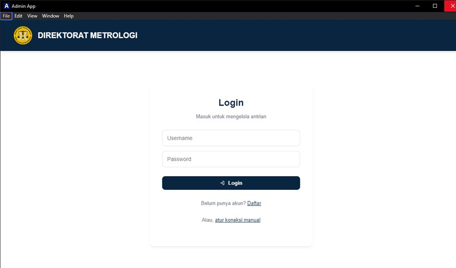
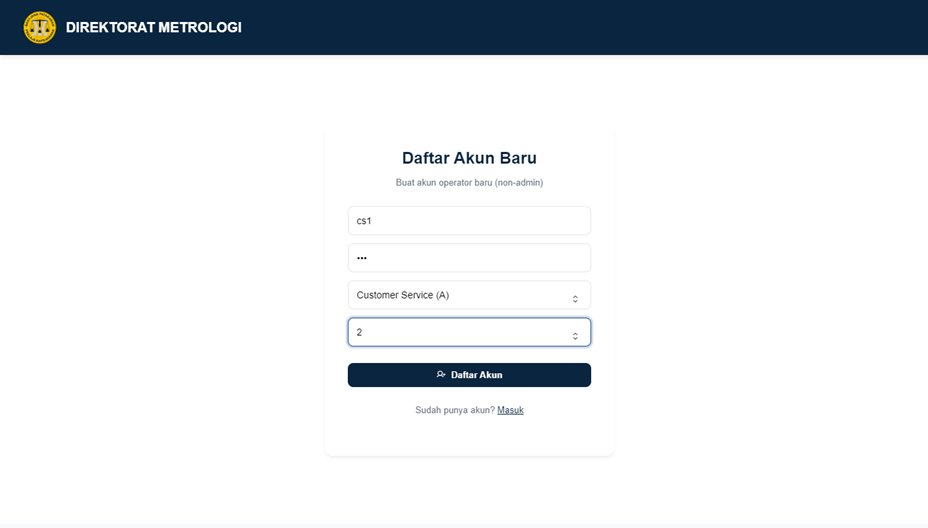
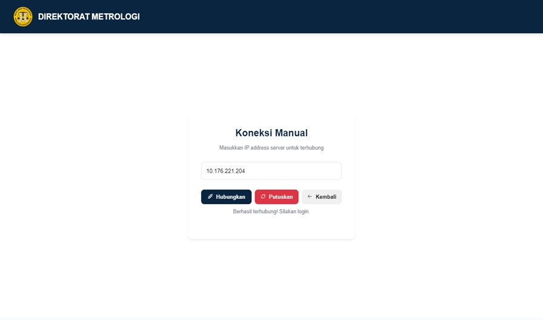
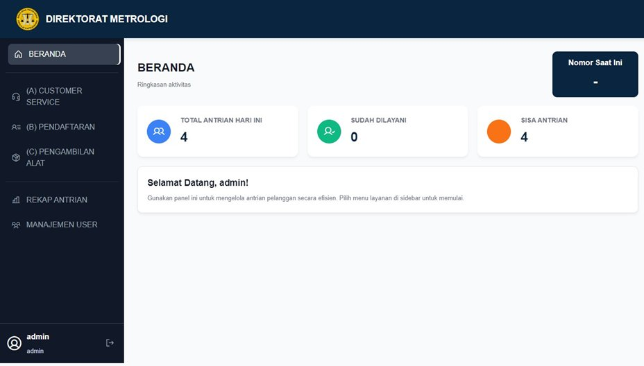
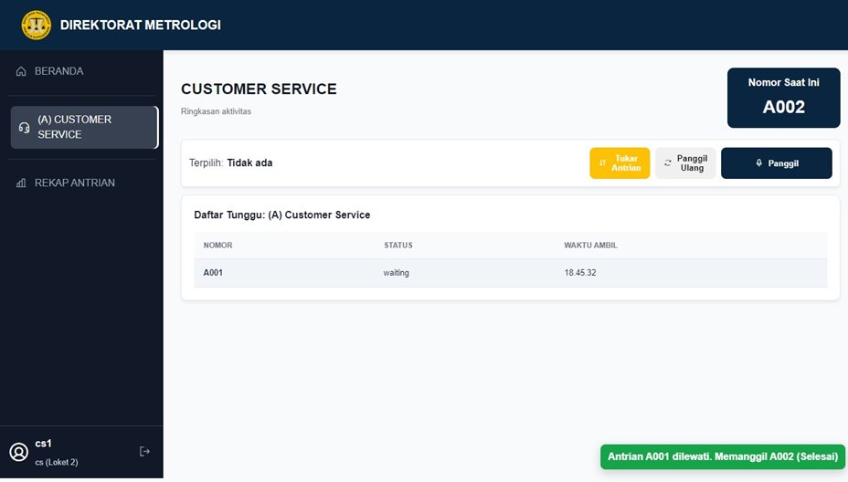
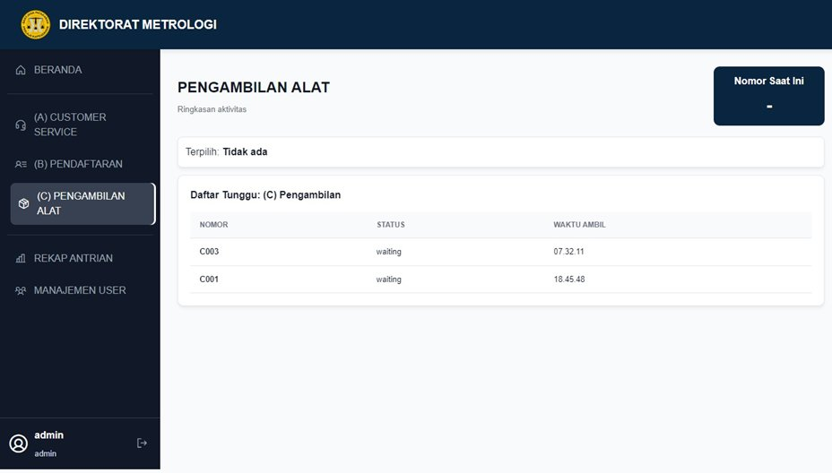
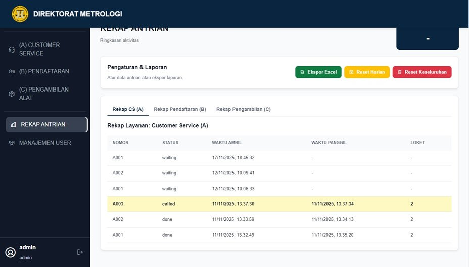
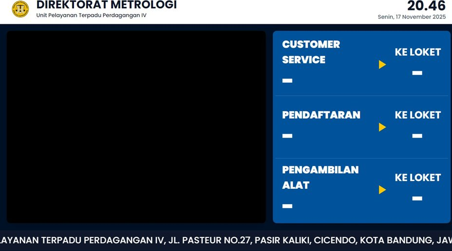

# Antrian Electron

Sistem manajemen antrian digital berbasis jaringan lokal untuk **Direktorat Metrologi** — Unit Pelayanan Terpadu Perdagangan IV. Sistem ini menghubungkan kiosk pengambilan nomor, operator loket, dan layar display ruang tunggu secara real-time melalui jaringan LAN.

---

## Unduh Aplikasi

| Paket | Keterangan | Tautan |
|-------|------------|--------|
| Installer (Admin + Kiosk) | Paket instalasi lengkap | [Download via Google Drive](https://drive.google.com/file/d/1mM4jeM4n0nSdRhgePvTD_CruwI44vVXM/view?usp=drive_link) |

---

## Arsitektur Sistem

Sistem terdiri dari empat komponen yang berjalan di atas jaringan lokal. **Kiosk App** berperan sebagai server utama, sementara Admin App dan Display TV bertindak sebagai klien yang terhubung melalui WebSocket.

```
┌─────────────┐        WebSocket        ┌─────────────────┐
│  Kiosk App  │ ◄──────────────────────►│   Admin App     │
│  (Server)   │                         │  (Operator)     │
│  Node.js +  │        WebSocket        ├─────────────────┤
│  SQLite     │ ◄──────────────────────►│   Display TV    │
└─────────────┘                         │  (Layar Tunggu) │
                                        └─────────────────┘
```

### Kiosk App — Server Utama & Mesin Antrian

Dijalankan pada perangkat kiosk sebagai **pusat server**. Seluruh logika data diproses di sini.

- Menerbitkan nomor antrian baru dan menyimpannya ke database
- Mengelola koneksi WebSocket ke semua klien
- Menangani notifikasi suara (bell + penyebutan nomor)

### Admin App — Operator Loket

Aplikasi ringan untuk petugas loket. Berjalan murni sebagai klien tanpa backend tersendiri, sehingga dapat dipasang di banyak komputer sekaligus.

- Memanggil antrian berdasarkan peran loket (Role A, B, C, dst.)
- Operasi antrian: **Call**, **Recall**, **Swap**, **Done**
- Menerima pembaruan data secara real-time

### Display TV — Layar Informasi Ruang Tunggu

Ditampilkan pada monitor besar di ruang tunggu pengunjung.

- Menampilkan nomor yang sedang dipanggil per loket
- Memutar playlist video dan teks berjalan
- Memperbarui tampilan secara otomatis tanpa interaksi manual

### Backend — Node.js + SQLite

Berjalan di dalam perangkat Kiosk dan menangani seluruh lapisan data sistem.

- Persistensi data antrian menggunakan SQLite
- Logika antrian: new queue, call, recall, skip, done, next
- UDP Discovery untuk deteksi server otomatis di jaringan lokal

---

## Persyaratan Sistem

| Komponen | Spesifikasi Minimum |
|----------|---------------------|
| Sistem Operasi | Windows 10 / 11 (64-bit) |
| RAM | 4 GB |
| Penyimpanan | 500 MB ruang kosong |
| Jaringan | LAN (kabel atau WiFi) |

> Sistem saat ini hanya mendukung platform Windows.

---

## Instalasi

### 1. Unduh File Installer

Klik tautan unduhan di atas, lalu simpan file `.exe` ke komputer.

### 2. Jalankan Installer

> **Catatan:** Jika muncul peringatan *"Windows protected your PC"*, klik **More info** → **Run anyway**. Ini wajar untuk aplikasi yang belum memiliki sertifikat penandatanganan kode.

1. Double-click file installer
2. Ikuti langkah-langkah pada wizard instalasi
3. Klik **Install** dan tunggu hingga proses selesai

### 3. Selesai

Shortcut aplikasi akan tersedia di Desktop dan Start Menu.

---

## Panduan Penggunaan Admin App

### Langkah 1 — Login

Buka **Admin App**, lalu masukkan username dan password akun operator.



Jika belum memiliki akun, klik **Daftar** untuk membuat akun operator baru.

---

### Langkah 2 — Pendaftaran Akun (jika diperlukan)

Isi formulir dengan username, password, jenis layanan, dan nomor loket.



> Akun yang dibuat melalui halaman ini memiliki hak akses **operator**, bukan admin.

---

### Langkah 3 — Koneksi ke Server Kiosk

Jika Admin App tidak terhubung secara otomatis melalui UDP Discovery, klik **"atur koneksi manual"** dan masukkan IP address perangkat Kiosk.



Setelah berhasil, akan muncul notifikasi: *"Berhasil terhubung! Silakan login."*

---

### Langkah 4 — Dashboard

Setelah login, halaman beranda menampilkan ringkasan aktivitas antrian hari ini: total antrian masuk, jumlah yang sudah dilayani, dan sisa antrian.



Navigasi tersedia di sidebar kiri:

| Menu | Fungsi |
|------|--------|
| (A) Customer Service | Loket layanan pelanggan |
| (B) Pendaftaran | Loket pendaftaran |
| (C) Pengambilan Alat | Loket pengambilan alat |
| Rekap Antrian | Laporan dan histori |
| Manajemen User | Pengelolaan akun operator (admin only) |

---

### Langkah 5 — Memanggil Antrian

Pilih menu layanan sesuai loket Anda, lalu gunakan tombol yang tersedia:

| Tombol | Fungsi |
|--------|--------|
| **Panggil** | Memanggil nomor antrian berikutnya |
| **Panggil Ulang** | Memanggil kembali nomor yang sama |
| **Tukar Antrian** | Menukar urutan antrian |



Nomor yang sedang aktif ditampilkan di pojok kanan atas (**Nomor Saat Ini**).

---

### Langkah 6 — Daftar Antrian per Layanan

Setiap halaman layanan menampilkan daftar antrian yang menunggu, lengkap dengan nomor, status, dan waktu pengambilan.



---

### Langkah 7 — Rekap & Laporan

Buka menu **Rekap Antrian** untuk mengakses histori lengkap. Tersedia tab per layanan dan sejumlah tindakan:

- **Ekspor Excel** — Unduh data antrian ke file `.xlsx`
- **Reset Harian** — Hapus data antrian hari ini
- **Reset Keseluruhan** — Hapus seluruh data antrian



---

### Tampilan Display TV

Layar di ruang tunggu menampilkan nomor antrian yang aktif dipanggil per loket secara real-time, dilengkapi jam, tanggal, dan informasi teks berjalan.



---

## Konfigurasi Jaringan

Semua komponen berkomunikasi melalui jaringan lokal (LAN). Pastikan kondisi berikut terpenuhi sebelum mengoperasikan sistem:

1. Kiosk App dan Admin App berada dalam **jaringan WiFi atau LAN yang sama**
2. Firewall tidak memblokir koneksi antar perangkat pada jaringan lokal
3. **Kiosk App dijalankan terlebih dahulu** sebelum Admin App atau Display TV dihidupkan
4. Jika koneksi otomatis tidak berhasil, gunakan fitur **Koneksi Manual** dengan IP address perangkat Kiosk

---

## Pemecahan Masalah

**Aplikasi tidak bisa dibuka setelah instalasi**
Klik kanan pada shortcut → pilih **Run as Administrator**.

**Admin App tidak bisa terhubung ke Kiosk**
Pastikan kedua perangkat berada di jaringan yang sama dan Kiosk App sudah berjalan. Coba sambungkan secara manual menggunakan IP address Kiosk.

**Error "missing DLL" saat aplikasi dibuka**
Instal **Microsoft Visual C++ Redistributable** versi terbaru dari situs resmi Microsoft.

**Cara menambah akun operator baru**
Login sebagai admin → buka menu **Manajemen User**, atau gunakan halaman **Daftar** dari layar login.

---

## Kontak & Dukungan

Untuk pertanyaan teknis atau laporan masalah, hubungi:

**Muhammad Fathan Safari**
📧 muhammadfathansafari@gmail.com

---

*Versi 1.2.1 — Direktorat Metrologi, Unit Pelayanan Terpadu Perdagangan IV*